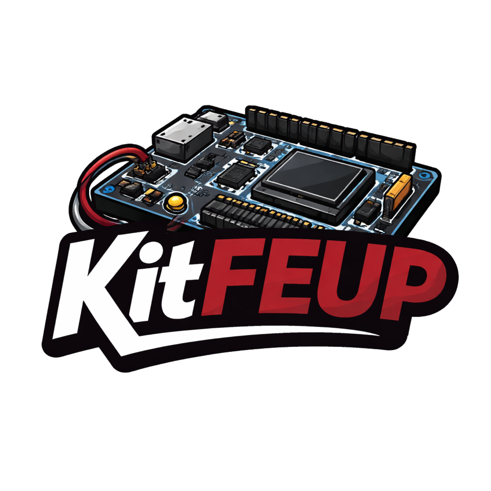

# KitFEUP - Milk-V Duo S LCOM PoC



KitFEUP is a proof-of-concept repository for using the Milk-V Duo S (SG2000, RISC-V) as a low-cost teaching platform across L.EIC courses, with the current focus on the LCOM user-space driver workflow via UMDP.

This repository is organized around a Nix-first development flow and a reproducible host-side automation layer.

## Scope

- Host-side cross-compilation and packaging on NixOS (via `nix-shell shell.nix`)
- UMDP kernel module + userspace library integration on Milk-V Duo S
- Working demos:
  - GPIO LED blink (`blink`, `blink_umdp`, `asm_led`)
  - Timer interrupt wait (`timer_wait`)
  - Timer-driven LED blink (`blink_timer`)
  - Multi logical timers on one hardware IRQ tick (`timer_multi`)
  - RTC uptime read (`uptime`)

## Repository Layout

- `shared/` - userspace demos and small driver libraries compiled for the board
- `patched-umdp/` - active UMDP codebase used in this PoC
- `duo-buildroot-sdk-v2/` - Milk-V SDK and kernel build tree (with local DTS/env patches)
- `scripts/nix/` - scripted build/sync/test helpers used by root `Makefile`
- `sg2000/` - hardware datasheets and references
- `PI/`, `milkv.io/`, `minix_milk_v_duo_s/` - reference material repositories retained for context

## Quick Start (Nix-first)

1. Enter development shell:

```sh
nix-shell shell.nix
```

2. Build everything:

```sh
make build-all
```

3. Sync module and binaries to board:

```sh
make sync-all
```

4. On board (`root@192.168.42.1`), reload module and run demos:

```sh
rmmod umdp 2>/dev/null || true
insmod shared/umdp.ko
shared/compiled/timer_wait
shared/compiled/blink_timer
shared/compiled/timer_multi
```

## Flashing Workflow (validated)

For iterative kernel/DT updates, use this workflow:

1. Build SDK boot artifacts (`make build-board-image`)
2. Mount SD boot partition (`/dev/sdX1`)
3. Copy generated `boot.sd` into mounted partition

Do not patch `boot.sd` into raw image byte offsets for iterative updates.

## Notes

- The active UMDP path is `patched-umdp/` (the upstream copy was removed from this workspace).
- Root-level automation assumes a local board reachable via USB ethernet defaults (`192.168.42.1`, `root`, `milkv`) and can be overridden via Make variables.
- This repository intentionally keeps cloned reference repos as gitlinks for traceability and collaboration with the wider KitFEUP effort.
